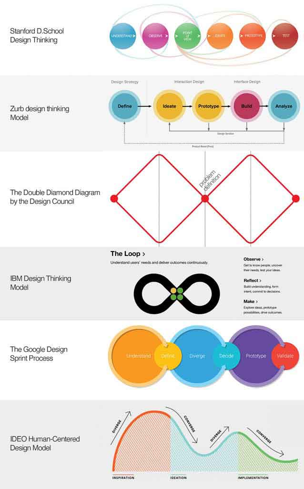

# Design Thinking Limits

> **Role in the project:** Research notes on how and why Design Thinking fails when misapplied — informing the iterative, non-linear structure of the LangGraph pipeline.
>
> **Source:** Article by Dr Rafiq Elmansy (@rafiqelmansy) — [Why Design Thinking Doesn't Work](https://www.designorate.com/why-design-thinking-doesnt-work/)
>
> **Leads to:** [Automated Solution Concept](../03-vision/automated-solution-concept.md), [LangGraph Pipeline Spec](../05-technical-spec/langgraph-pipeline-spec.md)

---

Notes from an article discussing the wrong way to apply design thinking — a human-centred approach to innovation that integrates the needs of people, the possibilities of technology, and the requirements for business success.

**Key points:**

- Some people are more creative and better able to practise it than others.
- From Harold van Doren's book in the 1950s, design is the balance point between **Desirability**, **Viability**, and **Feasibility**.
- Based on empathy.
- Design thinkers move **forward and backwards** to build a clear idea about complex problems.
- IDEO's CEO Tim Brown (same as van Doren): creative problem-solving should consider human desirability, business viability, and technological feasibility.
- Different design thinking models exist (see image below).
- **A model of design thinking cannot be linear.** It is more circular and iterative.
- Double Diamond and IBM models seem to be good approaches.
- In practice: any of the above tools cannot work effectively without a skilful facilitator and experienced participants to identify accurately the different aspects of the problem addressed and the best practices to solve it. Otherwise, you end with a nonsense meeting wasting time and effort.
- It starts by **exploring the problem rather than jumping to solutions**. This leads to a better understanding of the audience and a better product-market fit.
- You cannot have a successful design thinking practice without understanding the nature of design and how it reflects on the design thinking methodology.

