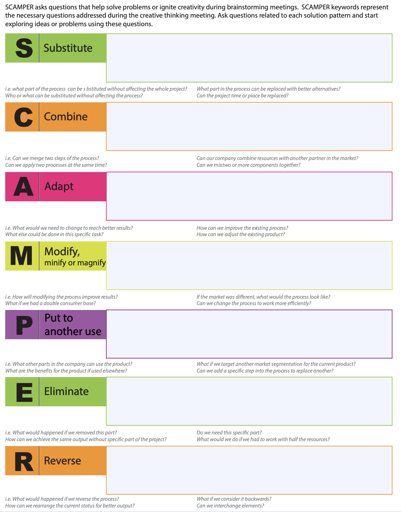

# Design Thinking Model Coupled with SCAMPER Method

> **Role in the project:** Methodology research explaining when and how SCAMPER is applied within the Design Thinking process. Directly informs the `scamper_task` node in the LangGraph pipeline.
>
> **Source:** Articles by Dr Rafiq Elmansy (@rafiqelmansy):
> - [A Guide to the SCAMPER Technique for Creative Thinking](https://www.designorate.com/a-guide-to-the-scamper-technique-for-creative-thinking/)
> - [SCAMPER Technique Examples and Applications](https://www.designorate.com/scamper-technique-examples-and-applications/)
>
> **Leads to:** [LangGraph Pipeline Spec](../05-technical-spec/langgraph-pipeline-spec.md) (see `scamper_task`)

---

Key findings from the article:

- We apply the **SCAMPER method** during the **"develop" or "make" stage** of Design Thinking.
- SCAMPER doesn't give us a final solution, but rather **multiple paths**. From those paths we can test different solutions to build a better product.

**SCAMPER template:**

| Letter | Action | Prompt |
|--------|--------|--------|
| **S** | Substitute | What can be substituted or swapped? |
| **C** | Combine | What can be combined or merged? |
| **A** | Adapt | What can be adapted or adjusted? |
| **M** | Modify / Magnify | What can be modified, magnified, or minimised? |
| **P** | Put to Another Use | How can this be used differently? |
| **E** | Eliminate | What can be removed or simplified? |
| **R** | Reverse / Rearrange | What can be reversed or rearranged? |

