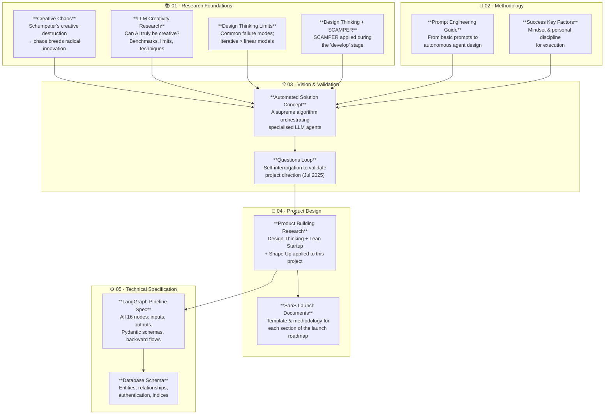

# Sding – Project Documentation

This folder contains the research, methodology notes, vision documents, product design analysis, and technical specifications that shaped the Sding project.

---

## Document Genealogy

The documents were produced in rough chronological order, each building on the ones before it. The diagram below captures the intellectual flow: from foundational research and methodology learning, through the emergence of the core concept, to concrete product design and technical specification.

---

## Document Index

### 01 · Research Foundations

| File | Summary | Key Concepts |
|------|---------|--------------|
| [`creative-chaos.md`](01-research/creative-chaos.md) | Schumpeter's "creative destruction": chaotic environments produce disruptive innovation rather than incremental improvement. | Disruption, Schumpeter, Silicon Valley startup philosophy |
| [`llm-creativity-research.md`](01-research/llm-creativity-research.md) | Academic review (2022–2025) of whether LLMs can be genuinely creative. Evidence, benchmarks, limitations. | AUT, DAT, TTCW, temperature, homogeneity, Chain-of-Thought |
| [`design-thinking-limits.md`](01-research/design-thinking-limits.md) | Notes on a Rafiq Elmansy article: when and why Design Thinking fails; why iterative > linear models. | Desirability/Viability/Feasibility, Double Diamond, IBM model |
| [`design-thinking-scamper.md`](01-research/design-thinking-scamper.md) | Notes on applying SCAMPER during the "develop" stage of Design Thinking. | SCAMPER, ideation paths, refinement |

### 02 · Methodology

| File | Summary | Key Concepts |
|------|---------|--------------|
| [`prompt-engineering-guide.md`](02-methodology/prompt-engineering-guide.md) | Comprehensive guide (6 chapters) on advanced prompt engineering for AI agents. Written in an Uber context but applicable to any LLM agent system. | Few-shot, Chain-of-Thought, role-play, prompt chaining, autonomous agents |
| [`success-key-factors.md`](02-methodology/success-key-factors.md) | Personal and social principles for execution and sustained success. | Delayed gratification, compound effect, focus, resilience |

### 03 · Vision & Validation

| File | Summary | Key Concepts |
|------|---------|--------------|
| [`automated-solution-concept.md`](03-vision/automated-solution-concept.md) | The core product concept: a "supreme algorithm" (LangGraph) orchestrating specialised LLM agents to auto-generate strategic project documents. | Multi-agent, AutoGen, document synthesis, orchestration |
| [`questions-loop.md`](03-vision/questions-loop.md) | A self-interrogation loop (Jul 2025) to validate the project's raison d'être and focus. | PMF, usefulness test, priority check |

### 04 · Product Design

| File | Summary | Key Concepts |
|------|---------|--------------|
| [`product-building-research.md`](04-product-design/product-building-research.md) | Critical analysis of each roadmap section with improvement recommendations, methodologies (DT, Lean Startup, Shape Up), and team responsibilities (5-person team). | Value Proposition Canvas, Business Model Canvas, OKR, MoSCoW, AARRR, JTBD |
| [`saas-launch-documents.md`](04-product-design/saas-launch-documents.md) | Worked example of a complete SaaS product launch document, section by section, with filling instructions, tools, and team roles. | MVP, Core Loop, competitive analysis, go-to-market, risk matrix |

### 05 · Technical Specification

| File | Summary | Key Concepts |
|------|---------|--------------|
| [`langgraph-pipeline-spec.md`](05-technical-spec/langgraph-pipeline-spec.md) | Full specification of the 16-node workflow: goal, inputs, output schemas, agent roles, backward flows. Node concepts are valid; tech references are Python/Pydantic — see implementation note. | HMW, SCAMPER, empathy map, JTBD, Crazy8s, prototyping |
| [`implementation-note.md`](05-technical-spec/implementation-note.md) | Records the switch from Python/LangGraph/Pydantic to Scala/Cats Effect. Maps every spec concept to its actual source file. | Scala, Cats Effect, WorkflowGraph, TaskNode, Circe |
| [`database-schema.md`](05-technical-spec/database-schema.md) | Relational database schema: entities, attributes, relationships, auth logic, recommended indices. | PostgreSQL, UUID, soft-delete, OIDC, JWT |

---

## Cross-References

| When reading… | Also read… |
|---------------|-----------|
| `automated-solution-concept.md` | `prompt-engineering-guide.md` (how to design LLM agents), `llm-creativity-research.md` (can AI handle creative tasks?) |
| `langgraph-pipeline-spec.md` | `design-thinking-scamper.md` (SCAMPER node context), `design-thinking-limits.md` (why iterative flows), `llm-creativity-research.md` (CoT / role-play agent design) |
| `product-building-research.md` | `saas-launch-documents.md` (worked example of the same framework) |
| `questions-loop.md` | `automated-solution-concept.md` (what was validated), `success-key-factors.md` (execution mindset) |
| `database-schema.md` | `langgraph-pipeline-spec.md` (pipeline state maps to schema entities) |
